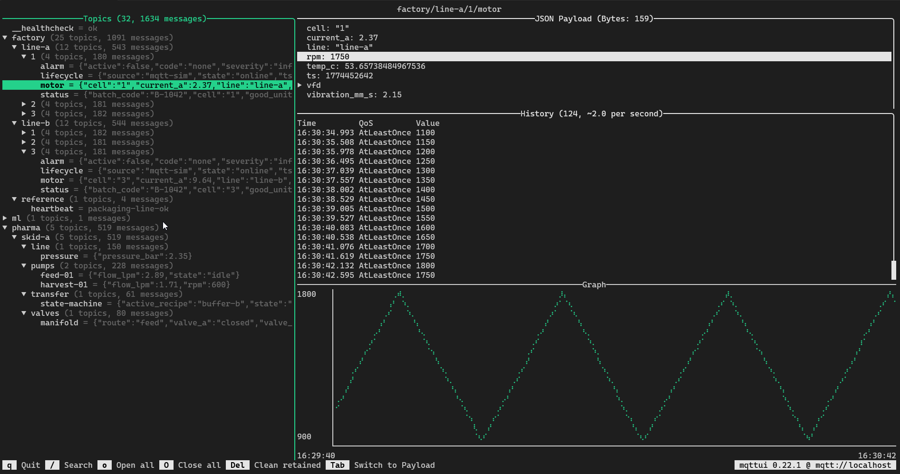

# MQTT Simulator

[](https://github.com/marcelo-6/mqtt-sim/actions/workflows/ci.yaml)
[](https://github.com/marcelo-6/mqtt-sim/actions/workflows/release.yml)
[](https://codecov.io/gh/marcelo-6/mqtt-sim)
[](https://pypi.org/project/mqtt-simulator/)

A MQTT simulator for publishing to a broker by simulating sensors, devices, and senarios.

[Features](#features) •
[Getting Started](#getting-started) •
[Configuration](#configuration) •
[History and Alternatives](#history-and-alternatives)


## Features

* Easy to configure simulator for publishing data to an MQTT broker
* Simple setup with a single JSON configuration file
* Publish data on predefined fixed topics
* Publish data on multiple topics that have a variable id or items at the end
* Simulated random variation of data based on configurable parameters
* Inline updating terminal table output for simulator status (with logs)

> [!NOTE]
> Below is a sample of the simulated data generated the terminal UI is [EdJoPaTo/mqttui](https://github.com/EdJoPaTo/mqttui)



## Getting Started

> [!NOTE]
> This assumes you already have a broker running on `localhost`. If not, use the Docker Compose below.

### Running using uv

Run the simulator with [uv](https://github.com/astral-sh/uv):

```shell
uv sync --dev
uv run mqtt-sim run -c examples/basic.json
```

### Running using Python

> [!TIP]
> `uv` Recommended instead

Run the simulator with a config file (`examples/basic.json`):

```shell
PYTHONPATH=src python3 -m mqtt_simulator run -c examples/basic.json
```

Validate a config before running:

```shell
PYTHONPATH=src python3 -m mqtt_simulator validate -c examples/basic.json
```

To install all dependencies with a virtual environment before using:

```shell
python3 -m venv venv
source venv/bin/activate
pip3 install -r requirements.txt
pip3 install -e .
```

### Running from Source with Docker Compose

This repo includes a `compose.yaml` with:

* `broker`: a local Mosquitto test broker with a health check
* `sim`: a `python:3.13-slim` container with this codebase mounted

> [!WARNING]
> This will start the broker first before running the simulator

```shell
docker compose up -d broker && docker compose run --rm sim run -c examples/basic.json --duration 10
```

Stop the broker when you are done:

```shell
docker compose down
```

### Running with the Standalone Dockerfile (optional)

You can also build the standalone image:

```shell
docker build -t mqtt-sim .
docker run --rm mqtt-sim --help
```

To run the bundled example against a broker running on your host:

```shell
docker run --rm --network host mqtt-sim run -c examples/basic.json --duration 10
```

> `--network host` is Linux-only. For a cross-platform local setup, prefer Docker Compose.

For release and publishing steps (`git-cliff`, `just release`, tag push, and CD expectations), see [release.md](./release.md).

## Configuration

See the [configuration documentation](./docs/configuration.md) for the current schema and configurable options.

Expression generator details (for `json_fields` payloads) are documented in:

* [docs/math_expression.md](./docs/math_expression.md)

For the schema used by the CLI, start with:

* [examples/basic.json](./examples/basic.json)
* [examples/many_streams.json](./examples/many_streams.json)
* [examples/pickle_file.json](./examples/pickle_file.json)
* [examples/README.md](./examples/README.md)

Below is a minimal configuration file for the implementation. It uses a single broker and range expansion to publish JSON payloads generated from multiple field generators:

```json
{
  "schema_version": 1,
  "brokers": [
    {
      "name": "main",
      "host": "broker.hivemq.com",
      "port": 1883
    }
  ],
  "streams": [
    {
      "broker": "main",
      "topic": "site/{id}/status",
      "interval": 2.0,
      "expand": {
        "kind": "range",
        "var": "id",
        "start": 1,
        "stop": 3
      },
      "payload": {
        "kind": "json_fields",
        "fields": [
          { "name": "ok", "generator": { "kind": "bool_toggle", "start": true } },
          { "name": "temp", "generator": { "kind": "number_random", "numeric_type": "float", "min": 20, "max": 40, "precision": 1 } }
        ]
      }
    }
  ]
}
```

## History and Alternatives

There are already great MQTT tools for quickly publishing something to a MQTT broker, but most of them solve a different problem than this project.

A big inspiration here is the original [DamascenoRafael/mqtt-simulator](https://github.com/DamascenoRafael/mqtt-simulator) project that I forked from. I wanted a quick way to simulate various types of devices and payloads close to the real devices I use at work.

Another big inspiration is [EdJoPaTo/mqttui](https://github.com/EdJoPaTo/mqttui), which is a fantastic Rust TUI for MQTT. It is fast and great for interactive MQTT work in the terminal.

Before that, tools like [MQTT Explorer](https://github.com/thomasnordquist/MQTT-Explorer), [EasyMQTT](https://www.easymqtt.app/), and [`mosquitto_pub` / `mosquitto_sub`](https://mosquitto.org/) were all useful depending on the situation. There are also feature-rich CLI options like [HiveMQ MQTT CLI](https://github.com/hivemq/mqtt-cli) and [MQTTX CLI](https://mqttx.app/docs/cli/get-started). They are great tools, but for my use case they are too complex. I wanted something simple.

That’s why this project exists: a MQTT simulator focused on generating many configurable payload streams (including file/binary payloads) with a inline status view. It is not trying to replace `mqttui` or other MQTT clients/viewers, it is focused on simulation.
