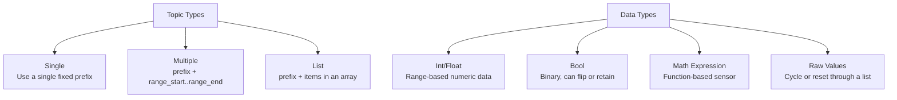

<!-- Improved compatibility of back to top link: See: https://github.com/othneildrew/Best-README-Template/pull/73 -->
<a id="readme-top"></a>
<!--
*** This README follows a structure inspired by othneildrew's Best-README-Template.
*** If you have suggestions for improvements, please open an issue or PR!
-->


<!-- PROJECT SHIELDS -->
<!--
*** Reference style links for readability. See the bottom of this doc for
*** the declaration of reference variables for contributors-url, forks-url, etc.
-->
<!-- [![Contributors][contributors-shield]][contributors-url]
[![Forks][forks-shield]][forks-url] -->
[![Stargazers][stars-shield]][stars-url]
[![Issues][issues-shield]][issues-url]
[![project_license][license-shield]][license-url]
<!-- [![LinkedIn][linkedin-shield]][linkedin-url] -->


<!-- PROJECT LOGO -->
<br />
<div align="center">
  <h3 align="center">MQTT Simulator</h3>

  <p align="center">
    A Python-based simulator for sending JSON objects from sensors/devices to an MQTT broker.
  </p>
</div>


<!-- TABLE OF CONTENTS -->
<details>
  <summary>Table of Contents</summary>
  <ol>
    <li><a href="#about-the-project">About The Project</a>
      <ul>
        <li><a href="#features">Features</a></li>
        <li><a href="#built-with">Built With</a></li>
      </ul>
    </li>
    <li><a href="#getting-started">Getting Started</a>
      <ul>
        <li><a href="#prerequisites">Prerequisites</a></li>
        <li><a href="#installation">Installation & Setup</a></li>
      </ul>
    </li>
    <li><a href="#usage">Usage</a>
      <ul>
        <li><a href="#global-configuration">Global Configuration</a></li>
        <li><a href="#topic-configuration">Topic Configuration</a></li>
        <li><a href="#data-configuration">Data Configuration</a></li>
      </ul>
    </li>
    <li><a href="#topic-types--data-types-explained">Topic Types & Data Types Explained</a></li>
    <li><a href="#roadmap">Roadmap</a></li>
    <li><a href="#contributing">Contributing</a></li>
    <li><a href="#license">License</a></li>
    <li><a href="#contact">Contact</a></li>
    <li><a href="#acknowledgments">Acknowledgments</a></li>
  </ol>
</details>


<!-- ABOUT THE PROJECT -->
## About The Project

The **MQTT Simulator** is a Python-based simulator designed to send JSON objects from sensors or devices to an MQTT broker. With flexible topic configurations and a variety of data types, it can simulate analog sensors (e.g., temperature, pressure), discrete sensors (boolean), raw data sequences, or even mathematical expressions. It's ideal for testing MQTT-based systems, simulating sensor networks, or stress-testing brokers.

<!-- [![Product Name Screen Shot][product-screenshot]](https://example.com) -->

<p align="right">(<a href="#readme-top">back to top</a>)</p>


### Features

- **Configurable Topics**
  Support for single, multiple, and list-based topics, each with custom data types (float, bool, raw values, math expressions).

- **MQTT Support**
  Simulates MQTT messages and publishes them to an MQTT broker at configurable intervals.

- **Data Types**
  Numeric ranges, boolean values with configurable probabilities, raw data sequences, and mathematical expressions.

- **Client Settings**
  Adjustable MQTT client parameters: QoS, retain, clean session, and time intervals.

- **Threaded Simulation**
  Each topic runs on its own thread, enabling parallel simulations of multiple sensors.

<p align="right">(<a href="#readme-top">back to top</a>)</p>


### Built With

- [Python 3](https://www.python.org/)
- [paho-mqtt](https://pypi.org/project/paho-mqtt/)
- [uv](https://pypi.org/project/uv/) (for package management)
- [Pydantic](https://pydantic-docs.helpmanual.io/) (for data validation)

<p align="right">(<a href="#readme-top">back to top</a>)</p>


<!-- GETTING STARTED -->
## Getting Started

This section explains how to set up the MQTT Simulator locally.

### Prerequisites

- **Python 3.6 or higher**
- A running MQTT broker (e.g., [Mosquitto](https://mosquitto.org/), [HiveMQ](https://www.hivemq.com/))
- [uv](https://pypi.org/project/uv/) for package management

### Installation

1. **Clone the repo**
   ```bash
   git clone https://github.com/marcelo-6/mqtt-sim.git
   ```
2. **Install dependencies**
   ```bash
   uv install
   ```
3. **Optional**: If you'd like to run tests, do from root folder:
   ```bash
   uv run pytest tests/
   ```

<p align="right">(<a href="#readme-top">back to top</a>)</p>


<!-- USAGE EXAMPLES -->
## Usage

After installing, you can run:

```bash
uv run app/main.py
```

By default, it looks for a `settings.json` in your `config/` folder. You can also specify a custom file:

```bash
uv run app/main.py -f path/to/settings.json
```

Below is a summary of the main configuration parameters:

### Global Configuration

```json
{
  "broker_url": "localhost",
  "broker_port": 1883,
  "protocol_version": 4,
  "clean_session": true,
  "retain": false,
  "qos": 2,
  "time_interval": 10,
  "verbose": false,
  "topics": []
}
```

| Key               | Type   | Default   | Description                                                                                                                   | Required |
| ----------------- | ------ | --------- | ----------------------------------------------------------------------------------------------------------------------------- | -------- |
| `broker_url`      | string | localhost | The URL or IP address of the MQTT broker.                                                                                     | Yes      |
| `broker_port`     | number | 1883      | The port used by the broker.                                                                                                  | Yes      |
| `protocol_version`| number | 4         | MQTT protocol version: `3`(MQTTv31), `4`(MQTTv311), or `5`(MQTTv5).                                                            | Yes      |
| `clean_session`   | bool   | true      | Whether to use a clean session (ignored if `protocol_version`=5).                                                             | No       |
| `retain`          | bool   | false     | Whether messages should be retained.                                                                                          | No       |
| `qos`             | number | 2         | Quality of Service level (0, 1, or 2).                                                                                       | No       |
| `time_interval`   | number | 10        | The time (in seconds) between consecutive messages.                                                                           | No       |
| `verbose`         | bool   | false     | Enables verbose logging for debugging.                                                                                       | No       |
| `topics`          | array  | —         | An array of topic configuration objects.                                                                                      | Yes      |

### Topic Configuration

```json
{
  "topic_type": "multiple",
  "prefix": "temperature",
  "range_start": 1,
  "range_end": 2,
  "time_interval": 25,
  "data": []
}
```

| Key             | Type           | Description                                                                                                                       | Required |
| --------------- | -------------- | ------------------------------------------------------------------------------------------------------------------------------- | -------- |
| `topic_type`    | string         | One of: `"single"`, `"multiple"`, `"list"`.                                                                                      | Yes      |
| `prefix`        | string         | The base topic name. For `"multiple"`, an ID is appended; for `"list"`, an item is appended.                                      | Yes      |
| `list`          | array\<any>    | For `"list"`, each item in the array is appended to `prefix`.                                                                      | If `topic_type`=`"list"` |
| `range_start`   | number         | For `"multiple"`, the starting ID.                                                                                                | If `topic_type`=`"multiple"` |
| `range_end`     | number         | For `"multiple"`, the ending ID.                                                                                                  | If `topic_type`=`"multiple"` |
| `clean_session` | bool           | Overrides global `clean_session`.                                                                                               | No       |
| `retain`        | bool           | Overrides global `retain`.                                                                                                       | No       |
| `qos`           | number         | Overrides global `qos`.                                                                                                          | No       |
| `time_interval` | number         | Overrides global `time_interval` for this topic.                                                                                 | No       |
| `payload_root`  | object         | Base JSON object included in every message.                                                                                     | Optional |
| `data`          | array\<object> | An array of data configuration objects.                                                                                          | Yes      |

### Data Configuration

```json
{
  "name": "temperature",
  "data_type": "float",
  "initial_value": 35,
  "min_value": 30,
  "max_value": 40,
  "max_step": 0.2,
  "retain_probability": 0.5,
  "reset_probability": 0.1,
  "increase_probability": 0.7,
  "restart_on_boundaries": true
}
```

| Key                    | Type         | Description                                                                                                                                         | Required |
| ---------------------- | ------------ | --------------------------------------------------------------------------------------------------------------------------------------------------- | -------- |
| `name`                 | string       | The JSON property name in the payload.                                                                                                              | Yes      |
| `data_type`            | string       | `"int"`, `"float"`, `"bool"`, `"math_expression"`, or `"raw_values"`.                                                                               | Yes      |
| `retain_probability`   | number       | Probability (0–1) of retaining the current value.                                                                                                   | No       |
| `reset_probability`    | number       | Probability (0–1) of resetting to `initial_value`.                                                                                                  | No       |
| `initial_value`        | varies       | A fixed starting value. If not provided, the simulator generates one for numeric/boolean or uses built-in logic for math/expressions.               | No       |
| `min_value`            | number       | Minimum value for `"int"` or `"float"`.                                                                                                             | If `data_type`=`"int"/"float"` |
| `max_value`            | number       | Maximum value for `"int"` or `"float"`.                                                                                                             | If `data_type`=`"int"/"float"` |
| `max_step`             | number       | Maximum step size for numeric types.                                                                                                                | If `data_type`=`"int"/"float"` |
| `increase_probability` | number       | Probability (0–1) that the next numeric value is greater than the old one.                                                                          | No       |
| `restart_on_boundaries`| bool         | If true, resets to `initial_value` when hitting `min_value` or `max_value`.                                                                         | No       |
| `math_expression`      | string       | A Python math expression using `x`.                                                                                                                 | If `data_type`=`"math_expression"` |
| `interval_start`       | number       | The initial `x` for math expressions.                                                                                                               | If `data_type`=`"math_expression"` |
| `interval_end`         | number       | The maximum `x` for math expressions.                                                                                                               | If `data_type`=`"math_expression"` |
| `min_delta`            | number       | Minimum change in `x` each iteration for math expressions.                                                                                          | If `data_type`=`"math_expression"` |
| `max_delta`            | number       | Maximum change in `x` each iteration for math expressions.                                                                                          | If `data_type`=`"math_expression"` |
| `index_start`          | number       | The starting index for `"raw_values"`.                                                                                                              | If `data_type`=`"raw_values"` |
| `index_end`            | number       | The ending index for `"raw_values"`.                                                                                                                | If `data_type`=`"raw_values"` |
| `restart_on_end`       | bool         | If true, restarts the array upon hitting `index_end`; otherwise the value becomes inactive.                                                         | No       |
| `values`               | array\<any>  | The array of possible values (for `"raw_values"`).                                                                                                  | If `data_type`=`"raw_values"` |
| `value_default`        | object       | Merged default object for each entry in `values` (if items are objects).                                                                            | No       |

<p align="right">(<a href="#readme-top">back to top</a>)</p>


## Topic Types & Data Types Explained

Below is a high-level overview showing how the simulator organizes MQTT topics and generates data:


```mermaid
flowchart TD
    A[Topic Types]
    A --> S[Single<br>Use a single fixed prefix]
    A --> M[Multiple<br>prefix + range_start..range_end]
    A --> L[List<br>prefix + items in an array]

    D[Data Types]
    D --> IF[Int/Float<br>Range-based numeric data]
    D --> B[Bool<br>Binary, can flip or retain]
    D --> ME[Math Expression<br>Function-based sensor]
    D --> RV[Raw Values<br>Cycle or reset through a list]
```

**Topic Types**:
- **Single**: One fixed topic (e.g. `air_quality`).
- **Multiple**: Range-based topics (e.g. `lamp/1`, `lamp/2`).
- **List**: A prefix plus a finite set of items (e.g. `temperature/roof`, `temperature/basement`).

**Data Types**:
- **Int / Float**: Numeric data with configurable min/max, step size, and probabilities.
- **Bool**: True/False with a retain or flip probability.
- **Math Expression**: Evaluate custom expressions, advancing a variable `x`.
- **Raw Values**: Publishes from a predefined list (e.g. GPS waypoints).

<p align="right">(<a href="#readme-top">back to top</a>)</p>


<!-- ROADMAP -->
## Roadmap

- [ ] Add Makefile

See the [open issues](https://github.com/marcelo-6/mqtt-sim/issues) for a full list of proposed features (and known issues).

<p align="right">(<a href="#readme-top">back to top</a>)</p>


<!-- CONTRIBUTING -->
## Contributing

Contributions are what make the open source community such an amazing place to learn, inspire, and create. Any contributions you make are **greatly appreciated**!

If you have a suggestion that would make this better, please fork the repo and create a pull request. You can also open an issue with the tag "enhancement".
Don't forget to give the project a star! Thanks again!

1. Fork the Project
2. Create your Feature Branch (`git checkout -b feature/AmazingFeature`)
3. Commit your Changes (`git commit -m 'Add some AmazingFeature'`)
4. Push to the Branch (`git push origin feature/AmazingFeature`)
5. Open a Pull Request

<!-- ### Top contributors:

<a href="https://github.com/marcelo-6/mqtt-sim/graphs/contributors">
  
</a>

<p align="right">(<a href="#readme-top">back to top</a>)</p>
 -->


<!-- LICENSE -->
## License

Distributed under the `project_license`. See `LICENSE.txt` for more information.

<p align="right">(<a href="#readme-top">back to top</a>)</p>


<!-- CONTACT -->
<!-- ## Contact

Your Name - [@twitter_handle](https://twitter.com/twitter_handle) - your.email@example.com

Project Link: [https://github.com/github_username/repo_name](https://github.com/github_username/repo_name)

<p align="right">(<a href="#readme-top">back to top</a>)</p> -->

<!-- ACK -->
## Acknowledgments

Forked from: [mqtt-simulator](https://github.com/DamascenoRafael/mqtt-simulator)

<p align="right">(<a href="#readme-top">back to top</a>)</p>

<!-- MARKDOWN LINKS & IMAGES (REFERENCE STYLE) -->
[contributors-shield]: https://img.shields.io/github/contributors/github_username/repo_name.svg?style=for-the-badge
[contributors-url]: https://github.com/github_username/repo_name/graphs/contributors
[forks-shield]: https://img.shields.io/github/forks/github_username/repo_name.svg?style=for-the-badge
[forks-url]: https://github.com/github_username/repo_name/network/members
[stars-shield]: https://img.shields.io/github/stars/github_username/repo_name.svg?style=for-the-badge
[stars-url]: https://github.com/github_username/repo_name/stargazers
[issues-shield]: https://img.shields.io/github/issues/github_username/repo_name.svg?style=for-the-badge
[issues-url]: https://github.com/github_username/repo_name/issues
[license-shield]: https://img.shields.io/github/license/github_username/repo_name.svg?style=for-the-badge
[license-url]: https://github.com/github_username/repo_name/blob/master/LICENSE.txt
[linkedin-shield]: https://img.shields.io/badge/-LinkedIn-black.svg?style=for-the-badge&logo=linkedin&colorB=555
[linkedin-url]: https://linkedin.com/in/linkedin_username
[product-screenshot]: images/screenshot.png
