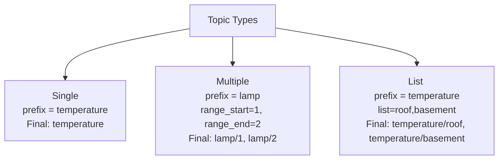
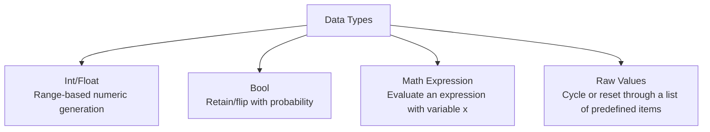

# MQTT Simulator

## Overview

The MQTT Simulator is a Python-based simulator designed to simulate the sending of JSON objects from sensors or devices to an MQTT broker. The simulator uses configurable topics and data, allowing for flexible simulation of various sensor types (e.g., analog values such as temperature, pressure, discrete values, raw data, and mathematical expressions). It can be used for testing MQTT-based systems, simulating sensor networks, or stress testing MQTT brokers.

## Features

- **Configurable Topics**: Support for single, multiple, and list-based topics, each with custom data types (e.g., float, bool, raw values, math expressions).
- **MQTT Support**: Simulates MQTT messages and publishes them to an MQTT broker at configurable intervals.
- **Data Types**: Supports numeric ranges, boolean values with configurable probabilities, raw data values, and mathematical expressions.
- **Client Settings**: Adjustable MQTT client settings, including `QoS`, `retain`, `clean session`, and time intervals between messages.
- **Threaded Simulation**: Each topic runs in its own thread to simulate parallel sensor networks.

## Getting Started

### Prerequisites

- [Python 3](https://www.python.org/) (Tested on 3.12)
- A running MQTT broker (e.g., [Mosquitto](https://mosquitto.org/), [HiveMQ](https://www.hivemq.com/), docker-compose file provided for local testing using Mosquitto)
- [uv](https://pypi.org/project/uv/) for package management

### Installing Dependencies

Create a virtual environment and install dependencies:

```shell
uv install
```

### Running the Simulator

Update the `config/settings.json` file with your broker and topic configurations.

Run the simulator with the default settings:

```shell
uv run app/main.py
```

Or specify an alternate settings file:

```shell
uv run app/main.py -f <path/to/settings.json>
```

## `settings.json` Configuration

The simulator is fully configured via the `config/settings.json` file. Below are details on every setting.

### Global Configuration

The top-level structure of `settings.json` is as follows:

```json
{
  "broker_url": "localhost",
  "broker_port": 1883,
  "protocol_version": 4,
  "clean_session": true,
  "retain": false,
  "qos": 2,
  "time_interval": 10,
  "verbose": true,
  "topics": [
    ...
  ]
}
```

| Key               | Type   | Default   | Description                                                                                                                   | Required |
| ----------------- | ------ | --------- | ----------------------------------------------------------------------------------------------------------------------------- | -------- |
| `broker_url`      | string | localhost | The URL or IP address of the MQTT broker where data will be published.                                                      | Yes      |
| `broker_port`     | number | 1883      | The port used by the broker.                                                                                                  | Yes      |
| `protocol_version`| number | 4         | The MQTT protocol version (use `3` for MQTTv31, `4` for MQTTv311, or `5` for MQTTv5).                                        | No      |
| `clean_session`   | bool   | true      | Whether to use a clean session (ignored if `protocol_version` is `5`).                                                       | No       |
| `retain`          | bool   | false     | Whether messages should be retained by the broker.                                                                          | No       |
| `qos`             | number | 2         | The Quality of Service level for publishing messages.                                                                      | No       |
| `time_interval`   | number | 10        | The time (in seconds) between each message submission.                                                                     | No       |
| `verbose`         | bool   | false     | Enables detailed logging of simulator events.                                                                               | No       |
| `topics`          | array  | —         | An array of topic configuration objects.                                                                                    | Yes      |

### Topic Configuration

Each object in the `topics` array defines a topic and follows this structure:

```json
{
  "topic_type": "multiple",
  "prefix": "temperature",
  "range_start": 1,
  "range_end": 2,
  "time_interval": 25,
  "data": [
    ...
  ]
}
```

| Key             | Type           | Description                                                                                                                   | Required                                          |
| --------------- | -------------- | ----------------------------------------------------------------------------------------------------------------------------- | ------------------------------------------------- |
| `topic_type`    | string         | Defines the topic format: `"single"`, `"multiple"`, or `"list"`.                                                              | Yes                                               |
| `prefix`        | string         | The base name of the topic. For `"multiple"`, an ID is appended; for `"list"`, an item is appended.                             | Yes                                               |
| `list`          | array\<any>    | When `topic_type` is `"list"`, each item in the array is appended to `prefix` as `/<item>`.                                     | Required if `topic_type` is `"list"`                |
| `range_start`   | number         | When `topic_type` is `"multiple"`, the starting ID.                                                                          | Required if `topic_type` is `"multiple"`            |
| `range_end`     | number         | When `topic_type` is `"multiple"`, the ending ID.                                                                            | Required if `topic_type` is `"multiple"`            |
| `clean_session` | bool           | Overrides the global `clean_session` for this topic.                                                                       | No                                                |
| `retain`        | bool           | Overrides the global `retain` for this topic.                                                                              | No                                                |
| `qos`           | number         | Overrides the global `qos` for this topic.                                                                                 | No                                                |
| `time_interval` | number         | Overrides the global `time_interval` for this topic.                                                                       | No                                                |
| `payload_root`  | object         | A base JSON object to include with every message for this topic.                                                           | No                                          |
| `data`          | array\<object> | An array of data configuration objects defining the sensor values and behavior.                                             | Yes                                               |

### Data Configuration

Within each topic, the `data` array defines sensor values. Each data object follows this structure:

```json
{
  "name": "temperature",
  "data_type": "float",
  "initial_value": 35,
  "min_value": 30,
  "max_value": 40,
  "max_step": 0.2,
  "retain_probability": 0.5,
  "reset_probability": 0.1,
  "increase_probability": 0.7,
  "restart_on_boundaries": true
}
```

| Key                    | Type         | Description                                                                                                                                                           | Required                                           |
| ---------------------- | ------------ | --------------------------------------------------------------------------------------------------------------------------------------------------------------------- | -------------------------------------------------- |
| `name`                 | string       | The property name in the generated JSON payload.                                                                                                                    | Yes                                                |
| `data_type`            | string       | The type of data. Valid values: `"int"`, `"float"`, `"bool"`, `"math_expression"`, or `"raw_values"`.                                                               | Yes                                                |
| `retain_probability`   | number       | (0–1) Probability to retain the current value.                                                                                                                      | Optional (default: `0`)                            |
| `reset_probability`    | number       | (0–1) Probability to reset to `initial_value`.                                                                                                                      | Optional (default: `0`)                            |
| `initial_value`        | varies       | The starting value. If not provided, one is generated automatically based on the type.                                                                               | Optional                                           |
| `min_value`            | number       | The minimum value (required for `"int"` and `"float"`).                                                                                                              | Required for `"int"` and `"float"`                 |
| `max_value`            | number       | The maximum value (required for `"int"` and `"float"`).                                                                                                              | Required for `"int"` and `"float"`                 |
| `max_step`             | number       | The maximum change allowed between successive values (required for `"int"` and `"float"`).                                                                             | Required for `"int"` and `"float"`                 |
| `increase_probability` | number       | (0–1) For `"int"` or `"float"`, the probability that the next value is greater than the previous one.                                                                | Optional (default: `0.5`)                          |
| `restart_on_boundaries`| bool         | For `"int"` or `"float"`, if true, resets to `initial_value` when reaching `min_value` or `max_value`.                                                                 | Optional (default: `false`)                        |
| `math_expression`      | string       | A mathematical expression (Python syntax) using variable `x` and math module functions (e.g., `"2*math.pow(x,2)+1"`).                                               | Required if `data_type` is `"math_expression"`     |
| `interval_start`       | number       | The starting value for `x` in a math expression.                                                                                                                     | Required for `"math_expression"`                   |
| `interval_end`         | number       | The ending value for `x` in a math expression.                                                                                                                       | Required for `"math_expression"`                   |
| `min_delta`            | number       | The minimum change added to `x` between iterations (for `"math_expression"`).                                                                                         | Required for `"math_expression"`                   |
| `max_delta`            | number       | The maximum change added to `x` between iterations (for `"math_expression"`).                                                                                         | Required for `"math_expression"`                   |
| `index_start`          | number       | The starting index for the `values` array (for `"raw_values"`).                                                                                                      | Optional (default: `0`)                            |
| `index_end`            | number       | The ending index for the `values` array (for `"raw_values"`).                                                                                                        | Optional (default: `len(values)-1`)                |
| `restart_on_end`       | bool         | If true and the index reaches `index_end`, resets to `index_start`; otherwise, the data becomes inactive.                                                             | Optional (default: `false`)                        |
| `values`               | array\<any>  | An array of values to be published (for `"raw_values"`).                                                                                                             | Required for `"raw_values"`                        |
| `value_default`        | object       | A default object merged with each item from `values` (if items are objects for `"raw_values"`).                                                                        | Optional (default: `{}`)                           |

## Topic Types

### Overview
The simulator supports three primary topic types—each offers a distinct way of constructing MQTT topic names, which in turn helps simulate different kinds of sensor networks or device setups.


```mermaid
flowchart TD
    A[Topic Types]
    A --> S[Single<br>prefix = temperature<br>Final: temperature]
    A --> M[Multiple<br>prefix = lamp<br>range_start=1, range_end=2<br>Final: lamp/1, lamp/2]
    A --> L[List <br>prefix = temperature<br>list=roof,basement<br>Final: temperature/roof, temperature/basement]
```

1. **Single**
   - **Description**: Creates a single fixed topic by using the provided `prefix`.
   - **Usage**: Suitable for simulating exactly one device or sensor that publishes all its data to the same topic (e.g., one temperature sensor in one room).
   - **Example**:
     - Prefix: `air_quality`
     - Final Topic: `air_quality`

2. **Multiple**
   - **Description**: Automatically generates multiple topics by appending numeric IDs in a specified range (`range_start` to `range_end`) to the `prefix`.
   - **Usage**: Ideal for simulating a group of similar devices, each with its own ID (e.g., multiple streetlights, each identified by an integer ID).
   - **Example**:
     - Prefix: `lamp`
     - Range Start: `1`, Range End: `2`
     - Final Topics: `lamp/1`, `lamp/2`

3. **List**
   - **Description**: Uses an array of items that will be appended to the `prefix` to form the final topic name.
   - **Usage**: Great for simulating devices or sensors in a finite set of known locations, or enumerating a custom list of items (e.g., `temperature/roof`, `temperature/basement`).
   - **Example**:
     - Prefix: `temperature`
     - List: `["roof", "basement"]`
     - Final Topics: `temperature/roof`, `temperature/basement`

---

## Data Types

### Overview
Each topic can include one or more data definitions within its `data` array. Data definitions specify how the simulator should generate the payload (JSON) for that specific property (field). Below are the supported data types:


```mermaid
flowchart TD
    D[Data Types]
    D --> N[Int/Float<br>Range-based numeric generation]
    D --> B[Bool<br>Retain/flip with probability]
    D --> ME[Math Expression<br>Evaluate an expression with variable x]
    D --> RV[Raw Values<br>Cycle or reset through a list of predefined items]
```

1. **Int / Float**
   - **Description**: Numeric values (integer or float) with adjustable ranges, steps, and probabilities for increasing/decreasing.
   - **Usage**: Ideal for simulating analog sensors (e.g., temperature, pressure, volume).

2. **Bool**
   - **Description**: Boolean values (`True`/`False`) with probability for retaining or flipping.
   - **Usage**: Perfect for on/off states, open/closed signals, or any binary sensor.

3. **Math Expression**
   - **Description**: Evaluates a Pythonic math expression (`math_expression`) using a variable `x` that changes at each iteration.
   - **Usage**: Great for advanced simulation scenarios where a sensor reading follows a predictable formula (e.g., parabolic or sinusoidal trends).

4. **Raw Values**
   - **Description**: Publishes elements from a predefined list (`values`). Each iteration moves to the next element, or restarts/ends based on your configuration.
   - **Usage**: Useful for enumerating custom states, replaying recorded data, or stepping through a finite sequence (e.g., GPS waypoints).

---

## License

This project is licensed under the MIT License - see the [LICENSE](LICENSE) file for details.

## Forked from

[https://github.com/DamascenoRafael/mqtt-simulator](https://github.com/DamascenoRafael/mqtt-simulator)
