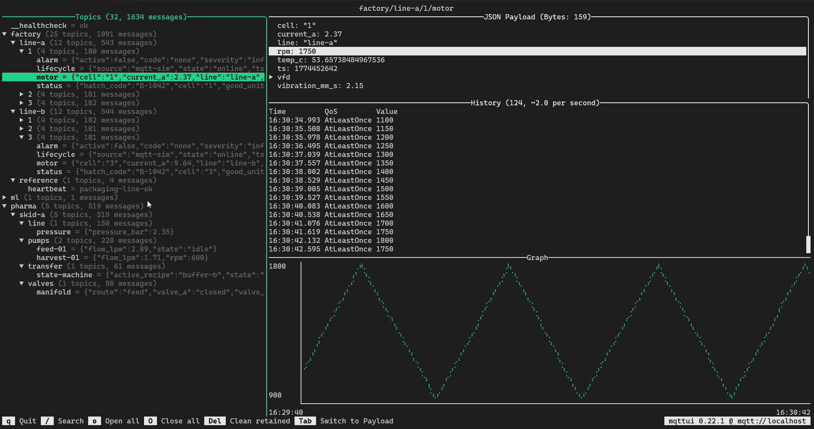

<!-- markdownlint-disable MD033 -->
# MQTT Simulator

[](https://github.com/marcelo-6/mqtt-sim/actions/workflows/ci.yaml)
[](https://github.com/marcelo-6/mqtt-sim/actions/workflows/release.yml)
[](https://codecov.io/gh/marcelo-6/mqtt-sim)
[](https://pypi.org/project/mqtt-simulator/)


A MQTT simulator for publishing to a broker by simulating sensors, devices, and senarios.

`mqtt-sim` reads a TOML file and starts publishing realistic MQTT traffic:
device state, sensor readings, lifecycle messages, file payloads, bursts,
slow streams, fast streams, whatever you need for testing or demos.

[Features](#features) |
[Quick Start](#quick-start) |
[Install and Run](#install-and-run) |
[Configuration](#configuration) |
[History and Alternatives](#history-and-alternatives)


## Features

* Easy to configure simulator for publishing data to a MQTT broker
* Supports multiple brokers, clients, streams, and payload types in one config file
* Inline table output while the simulator is running

> [!NOTE]
> Below is a sample of the simulated data generated, the terminal UI is [EdJoPaTo/mqttui](https://github.com/EdJoPaTo/mqttui)



## Quick Start

If you just want to see it work, use a broker on `localhost:1883` and this
config (better examples under `examples/*`):

```toml
config_version = 1

[brokers.main]
host = "localhost"

[clients.main]
broker = "main"
id = "demo-${device_id}"

[[streams]]
client = "main"
topic = "demo/${device_id}/status"
every = "1s"

[streams.expand]
device_id = { range = [1, 3] }

[streams.payload.json]
ok = { toggle = true }
temperature_c = { random = { type = "float", min = 18, max = 32, precision = 1 } }
ts = { time = "unix" }
```

Once installed, run:

```shell
mqtt-sim validate -c config.toml
mqtt-sim run -c config.toml
```

No broker running yet? If you cloned this repo, the fastest local one is:

```shell
docker compose up -d broker
```

## Install and Run

> [!NOTE]
> Python `3.13+` is required if you are not using docker.

Pick the path that matches how you want to use it.

> [!TIP]
> <details>
>
> <summary>Just want to use the tool? Install it from PyPI</summary>
>
> ```bash
> uv tool install mqtt-simulator
> mqtt-sim --help
> ```
>
> Then run it with your own config (or use the examples in this repo):
>
> ```bash
> mqtt-sim validate -c config.toml
> mqtt-sim run -c config.toml
> ```
>
> </details>
>
> <details>
>
> <summary>Do not want to install any Python stuff? Use the GHCR docker image instead.</summary>
>
>
> ```bash
> docker run --rm ghcr.io/marcelo-6/mqtt-sim:latest --help
> ```
>
> To run your own config file:
>
> ```bash
> docker run --rm \
>   -v "$PWD:/work" \
>   ghcr.io/marcelo-6/mqtt-sim:latest \
>   validate -c /work/config.toml
>
> docker run --rm \
>   -v "$PWD:/work" \
>   ghcr.io/marcelo-6/mqtt-sim:latest \
>   run -c /work/config.toml
> ```
>
> If your broker is running on your host, you may want `--network host` on Linux.
>
> </details>

<details>

<summary>Not using <q>uv</q>?</summary>

```bash
python3 -m venv .venv
source .venv/bin/activate
python -m pip install mqtt-simulator
mqtt-sim --help
```

Then:

```bash
mqtt-sim validate -c config.toml
mqtt-sim run -c config.toml
```

</details>

> [!IMPORTANT]
> <details>
>
> <summary>Want the examples? Clone the repo and use <q>uv</q>.</summary>
>
> ```bash
> git clone https://github.com/marcelo-6/mqtt-sim.git
> cd mqtt-sim
> uv sync
> uv run mqtt-sim validate -c examples/basic.toml
> uv run mqtt-sim run -c examples/basic.toml
> ```
>
> If you need a local broker too:
>
> ```bash
> docker compose up -d broker
> ```
>
> </details>

## Configuration

See the [configuration documentation](./docs/configuration.md) for the current schema and configurable options.

For the schema used by the CLI, start with:

* [examples/basic.toml](./examples/basic.toml)
* [examples/README.md](./examples/README.md)

If you are mostly interested in the expression generator, there is a focused
page for that too:

* [docs/math_expression.md](./docs/math_expression.md)

The shipped examples are heavily commented on purpose, so you can read them and copy only the sections you need.

If you want the full schema, see [docs/configuration.md](./docs/configuration.md).
If you just want something to ~~steal and tweak~~ reference existing config, the examples folder is usually
the better starting point.

## History and Alternatives

There are already great MQTT tools for quickly publishing something to a MQTT broker, but most of them solve a different problem than this project.

A big inspiration here is the original [DamascenoRafael/mqtt-simulator](https://github.com/DamascenoRafael/mqtt-simulator) project that I forked from. I wanted a quick way to simulate various types of devices and payloads close to the real devices I use at work.

Another big inspiration is [EdJoPaTo/mqttui](https://github.com/EdJoPaTo/mqttui), which is a fantastic Rust TUI for MQTT. It is fast and great for interactive MQTT work in the terminal.

Before that, tools like [MQTT Explorer](https://github.com/thomasnordquist/MQTT-Explorer), [EasyMQTT](https://www.easymqtt.app/), and [`mosquitto_pub` / `mosquitto_sub`](https://mosquitto.org/) were all useful depending on the situation. There are also feature-rich CLI options like [HiveMQ MQTT CLI](https://github.com/hivemq/mqtt-cli) and [MQTTX CLI](https://mqttx.app/docs/cli/get-started). They are great tools, but for my use case they are too complex. I wanted something simple.

That’s why this project exists: a MQTT simulator focused on generating many configurable payload streams (including file/binary payloads) with a inline status view. It is not trying to replace `mqttui` or other MQTT clients/viewers, it is focused on simulation.
