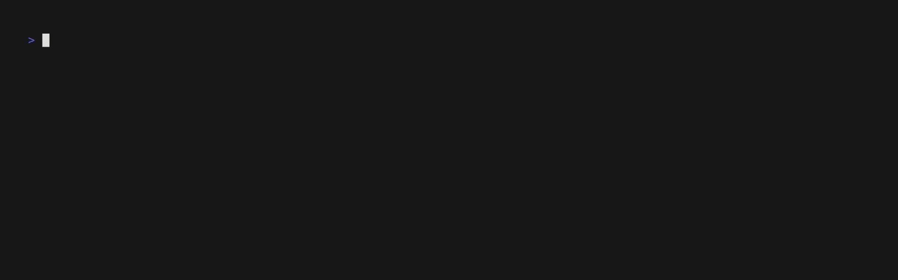

# Example Library

This folder contains example configs.

## Quick Start

Validate an example:

```bash
uv run mqtt-sim validate -c examples/basic.json
```

Run an example for a short session:

```bash
uv run mqtt-sim run -c examples/basic.json --duration 10
```

Most examples target a local broker at `localhost:1883`. Start one quickly with Mosquitto:

```bash
docker run --rm -it -p 1883:1883 eclipse-mosquitto
```

## Start Here

| File | What it demonstrates |
| --- | --- |
| [`basic.json`](./basic.json) | Minimal `json_fields` payload with `range` expansion |
| [`many_streams.json`](./many_streams.json) | Higher stream count / load-style example (13 resolved streams) |
| [`pickle_file.json`](./pickle_file.json) | `pickle_file` payload (publishes raw file bytes, no unpickling) |

## Domain

<details>

<summary>Smart Home</summary>

### Smart Home

| File | Highlights |
| --- | --- |
| [`smart_home/home_climate_and_lighting.json`](./smart_home/home_climate_and_lighting.json) | Thermostat, lights, humidity, occupancy; `json_fields`, `expression`, `bool_toggle` |
| [`smart_home/access_and_security.json`](./smart_home/access_and_security.json) | Door lock, garage door, motion, doorbell events, window contact; `json_fields` + `sequence` payload |
| [`smart_home/energy_devices.json`](./smart_home/energy_devices.json) | Smart plug, EV charger, solar inverter, battery, grid meter; energy metrics and state streams |


</details>

<details>

<summary>Wearables</summary>

### Wearables

| File | Highlights |
| --- | --- |
| [`wearables/fitness_trackers.json`](./wearables/fitness_trackers.json) | 1 template expanded to 5 trackers via `list`; heart rate, steps, calories, battery |
| [`wearables/smartwatch_health_streams.json`](./wearables/smartwatch_health_streams.json) | SpO2, stress, sleep, activity, GPS; `uuid`, `timestamp`, mixed sensor types |


</details>

<details>

<summary>Connected Appliances</summary>

### Connected Appliances

| File | Highlights |
| --- | --- |
| [`appliances/kitchen_appliances.json`](./appliances/kitchen_appliances.json) | Fridge, oven, dishwasher, coffee machine, microwave |
| [`appliances/laundry_room.json`](./appliances/laundry_room.json) | Washer/dryer cycle state, vibration, temperature, leak sensor |


</details>

</details>

<details>

<summary>Industrial</summary>

### Industrial

| File | Highlights |
| --- | --- |
| [`industrial/machine_condition_monitoring.json`](./industrial/machine_condition_monitoring.json) | Vibration, bearing temp, RPM, power draw, machine state |
| [`industrial/environmental_conditions.json`](./industrial/environmental_conditions.json) | 1 template expanded to 5 zones via `range`; temp/humidity/pressure/noise |
| [`industrial/line_station_status.json`](./industrial/line_station_status.json) | Station state machine, cycle time, rejects, throughput, alarm events |


</details>

</details>

<details>

<summary>Pharma / Bioprocess</summary>

### Pharma / Bioprocess

| File | Highlights |
| --- | --- |
| [`pharma/bioreactor_core_signals.json`](./pharma/bioreactor_core_signals.json) | Bioreactor temperature, pH, DO, agitation, state machine |
| [`pharma/pumps_valves_and_flows.json`](./pharma/pumps_valves_and_flows.json) | Pumps, valves, line pressure, transfer state |
| [`pharma/uv_and_process_skid.json`](./pharma/uv_and_process_skid.json) | UV absorbance, process temp/flow, multiple skid state machines |


</details>

</details>

<details>

<summary>ML / Inference</summary>

### ML / Inference

| File | Highlights |
| --- | --- |
| [`ml/inference_results_stream.json`](./ml/inference_results_stream.json) | Inference results, latency, routing, status, batch summaries |
| [`ml/model_monitoring_and_drift.json`](./ml/model_monitoring_and_drift.json) | Drift score, feature stats, prediction distribution, route mix, alerts |


</details>

</details>

<details>

<summary>File Transfer / Binary Payloads</summary>

### File Transfer / Binary Payloads

| File | Highlights |
| --- | --- |
| [`file_transfer/file_drop_events.json`](./file_transfer/file_drop_events.json) | Metadata/status/checksum/retry/completion event streams |
| [`file_transfer/binary_payload_examples.json`](./file_transfer/binary_payload_examples.json) | `bytes` (`utf8`/`hex`/`base64`), `file`, and `pickle_file` payload kinds |
| [`file_transfer/chunked_transfer_simulation.json`](./file_transfer/chunked_transfer_simulation.json) | Chunk metadata, file chunk bytes, ACKs, session start/complete |




</details>

</details>

<details>

<summary>Shared Data Files</summary>

## Shared Data Files

These files are referenced by some file/binary examples:

| File | Used by |
| --- | --- |
| [`data/sample.pkl`](./data/sample.pkl) | `pickle_file.json`, `file_transfer/binary_payload_examples.json` |
| [`data/sample.bin`](./data/sample.bin) | `file_transfer/binary_payload_examples.json` |
| [`data/firmware_chunk_001.bin`](./data/firmware_chunk_001.bin) | `file_transfer/chunked_transfer_simulation.json` |


</details>

## Notes

- Some examples use stream expansion (`range` / `list`) to create multiple resolved streams from one template.
- `pickle_file` publishes raw bytes from disk. It does not unpickle.
